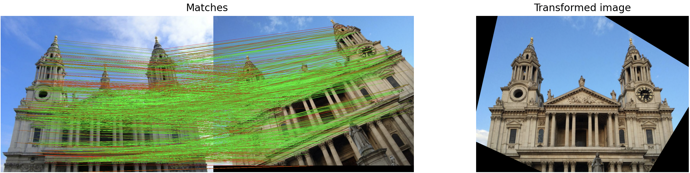

# ALIKED-LightGlue-ONNX
ALIKED-LightGlue local feature matching with ONNX  
Easier deployment and faster inference than pytorch



## ONNX Inference
test.py
```python
import cv2
from aliked_lightglue_onnx import AlikedLightGlueONNX

# load onnx model
aliked_path = "onnx/aliked-n16rot-top2k-640.onnx"
lightglue_path = "onnx/lightglue_for_aliked.onnx"
model = AlikedLightGlueONNX(aliked_path,lightglue_path)

# load images
img0 = cv2.imread("assets/st_pauls_cathedral/1.jpg")
img1 = cv2.imread("assets/st_pauls_cathedral/3.jpg")

# infer
m_kpts0, m_kpts1, score = model(img0,img1)

# calculate transformed image
ret,transformed_img = model.transform_image(img0,img1,
                                            m_kpts0,m_kpts1)

# draw matches
matches_img = model.draw_matches(img0,img1,m_kpts0,m_kpts1,score)

# visualize matches and transformed image
model.show_result(img0,img1,m_kpts0,m_kpts1,score)

# If you want infer between a specified image and others,
# register and extract kpts as a template in advance
model.register_template("0",img0)
# reuse template on inference (faster than passing 2 images)
m_kpts0, m_kpts1, score = model("0",img1)

```

## ONNX Weights
Saved in onnx directory

## ALIKED model conversion to ONNX
ALIKED onnx conversion is based on implementation below  
Difference is adding an argument "size" for static input.
https://github.com/ajuric/aliked-tensorrt
```
$ python convert_pytorch_to_onnx.py \
    assets/tum \
    --model aliked-n16rot \
    --model_output onnx/aliked-n16rot-top1k-tum.onnx \
    --opset_version 17 \
    --verbose \
    --top_k 1000
    --size 640  # model input size to (640,640)
```
## Credits
All codes in this repository is based on great works shown below.


LightGlue  
https://github.com/cvg/LightGlue
```
@inproceedings{lindenberger2023lightglue,
  author    = {Philipp Lindenberger and
               Paul-Edouard Sarlin and
               Marc Pollefeys},
  title     = {{LightGlue: Local Feature Matching at Light Speed}},
  booktitle = {ICCV},
  year      = {2023}
}
```
ALIKED  
https://github.com/Shiaoming/ALIKED

ALIKED-tensorRT  
https://github.com/ajuric/aliked-tensorrt

LightGlue-ONNX  
https://github.com/fabio-sim/LightGlue-ONNX

## License
This project is licensed under the MIT License.